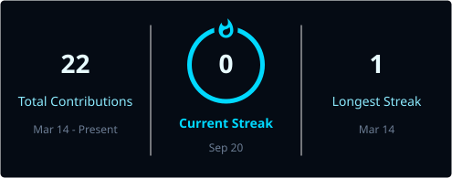

# `> DAVID_MOTA // SYSTEM ONLINE`

<div align="center">


<br>


<br>


</div>

---

## `// SYSTEM_BOOT`

```text
╔══════════════════════════════════════════════════════════╗
║                 DAVID MOTA // AI CORE                    ║
╠══════════════════════════════════════════════════════════╣
║ STATUS      :: ONLINE                                    ║
║ ROLE        :: ADS STUDENT                               ║
║ LOCATION    :: BRAZIL 🇧🇷                                ║
║ MISSION     :: EM BUSCA DO NOVO                          ║
║ FOCUS       :: SOFTWARE • AI • ARCHITECTURE              ║
╚══════════════════════════════════════════════════════════╝

> Loading neural interface.............. [██████████] 100%
> Loading developer profile............. [██████████] 100%
> Establishing connection............... [██████████] 100%

SYSTEM READY.
```

---

## `// ABOUT_ME`

<div align="center">

### 👨‍💻 David Mota

**Estudante de Análise e Desenvolvimento de Sistemas**

> Em busca do novo.

Sou estudante de **ADS** e entusiasta de tecnologia, desenvolvimento de software e inteligência artificial.
Atualmente estou construindo minha base como desenvolvedor, explorando diferentes tecnologias e buscando compreender não apenas **como criar software**, mas também como projetar sistemas melhores, escaláveis e inteligentes.

Minha jornada está focada em transformar curiosidade em conhecimento e conhecimento em projetos reais.

</div>

---

## `// TECH_STACK`

<div align="center">

### Core Technologies

<a href="https://www.python.org/">

</a>
&nbsp;
<a href="https://developer.mozilla.org/en-US/docs/Web/JavaScript">

</a>
&nbsp;
<a href="https://nodejs.org/">

</a>
&nbsp;
<a href="https://react.dev/">

</a>
&nbsp;
<a href="https://www.postgresql.org/">

</a>
&nbsp;
<a href="https://www.docker.com/">

</a>
&nbsp;
<a href="https://aws.amazon.com/">

</a>

<br><br>


</div>

---

## `// DEVELOPMENT_ENVIRONMENT`

<table align="center">
<tr>
<td align="center" width="180">

### ⚡ Runtime

Python<br>
Node.js<br>
JavaScript

</td>

<td align="center" width="180">

### 🧩 Frontend

React<br>
JavaScript<br>
HTML / CSS

</td>

<td align="center" width="180">

### 🗄️ Backend

Node.js<br>
PostgreSQL<br>
APIs

</td>

<td align="center" width="180">

### ☁️ Infrastructure

Docker<br>
AWS<br>
Cloud

</td>
</tr>
</table>

---

## `// CURRENT_MISSION`

```text
┌──────────────────────────────────────────────────────────────┐
│                     CURRENT OBJECTIVES                       │
├──────────────────────────────────────────────────────────────┤
│                                                              │
│  [01] > Building AI-powered applications                    │
│                                                              │
│  [02] > Learning advanced system architecture                │
│                                                              │
│  [03] > Contributing to open source                          │
│                                                              │
│  [04] > Developing my personal SaaS                          │
│                                                              │
└──────────────────────────────────────────────────────────────┘

STATUS: IN PROGRESS ███████████████░░░░░░░
```

---

## `// PROJECT_DATABASE`

<div align="center">

### `PROJECTS // SCANNING...`

```text
> Searching repository database...
> Analyzing featured projects...
> No projects registered yet.

[ SYSTEM MESSAGE ]

The first deployments are currently under development.
New projects will be added here as they become production-ready.

STATUS :: STANDBY
```

</div>

> 🚀 **Future deployments:** AI applications, SaaS projects, automation tools and experiments will be added to this section.

---

## `// GITHUB_ANALYTICS`

<div align="center">

### `SYSTEM METRICS // GITHUB PERFORMANCE`





<br><br>



<br><br>


</div>

---

## `// ACTIVITY_MONITOR`

<div align="center">


</div>

---

## `// ACHIEVEMENTS`

<div align="center">

### `GITHUB TROPHIES // ACHIEVEMENTS`



</div>

---

## `// CONTRIBUTION_MATRIX`

<div align="center">

### `NEURAL ACTIVITY // CONTRIBUTION SNAKE`

<picture>
  <source
    media="(prefers-color-scheme: dark)"
    srcset="https://raw.githubusercontent.com/print-davidmota/print-davidmota/refs/heads/gh-pages/github-contribution-grid-snake-dark.svg"
  />

  <source
    media="(prefers-color-scheme: light)"
    srcset="https://raw.githubusercontent.com/print-davidmota/print-davidmota/refs/heads/gh-pages/github-contribution-grid-snake.svg"
  />

  

</picture>

</div>

---

## `// NETWORK`

<div align="center">

<a href="mailto:djdavidsilva4@gmail.com">

</a>

<a href="https://github.com/print-davidmota">

</a>

</div>

---

<div align="center">

```text
╔══════════════════════════════════════════════════════════╗
║                                                          ║
║                 "EM BUSCA DO NOVO."                     ║
║                                                          ║
║        BUILD  •  LEARN  •  CREATE  •  REPEAT            ║
║                                                          ║
╚══════════════════════════════════════════════════════════╝
```


**`SYSTEM STATUS: ONLINE // ALWAYS LEARNING`**

</div>
